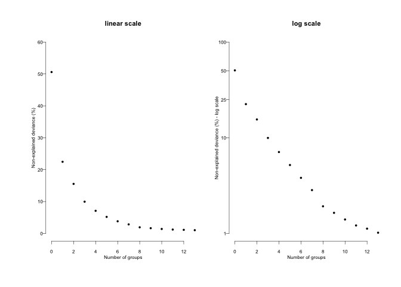
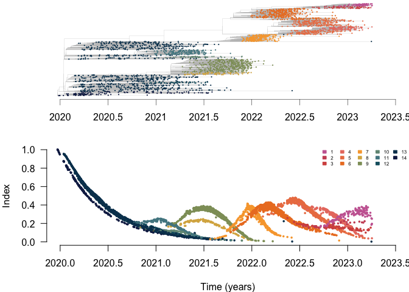
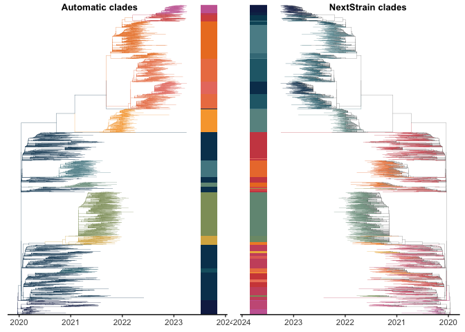
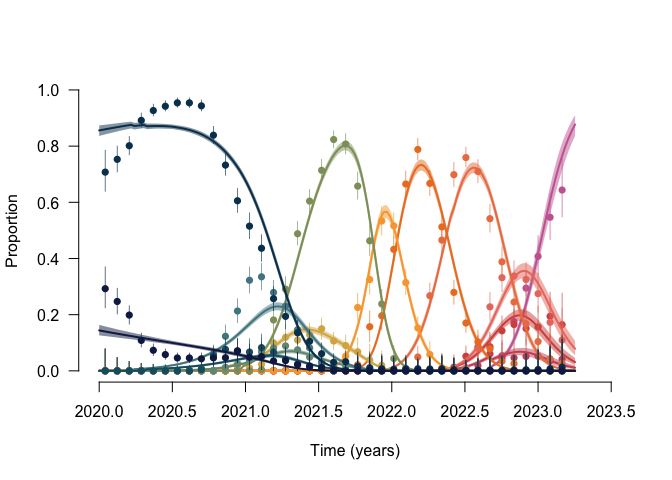
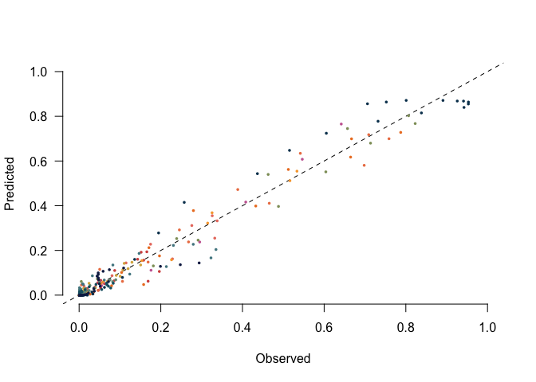
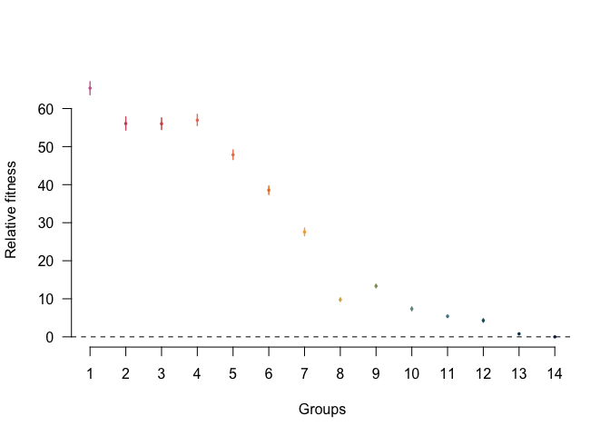

Code for the paper ‘Learning the fitness dynamics of pathogens from
phylogenies’
================

Last update: 10 September 2024

# Content of this repo

In this repo you will find:

1.  In `1_Data`, the data used in the paper.
2.  In `2_Functions`, the codes that are behind the analysis:
    - fitness index dynamics
    - lineages detection
    - lineage fitness estimation
    - lineage-defining mutations

# Content of this README

1.  [General guidance](#general-guidance) on how to use *phylowave* on
    your data
2.  [An example](#example-on-sars-cov-2) of lineage detection on a
    SARS-CoV-2 phylogeny

# General guidance

*phylowave* is an approach that summarises changes in population
composition in phylogenetic trees of pathogens, allowing for the
automatic detection of lineages based on shared fitness and evolutionary
relationships. It is currently written in R, with the exception of the
fitness model which is written in Stan. On principle, *phylowave* is
applicable to any pathogen (*e.g.* from viruses and bacteria) provided a
timed-phylogeny is available and the sampling is representative of the
diversity.

Here we describe the general organisation of the pipeline, which is
detailed in the following sections:

- [Input](#input)
- [Index computation](#index-computation)
- [Lineage detection](#lineage-detection)
- [Quantification of lineages’
  fitness](#quantification-of-lineages-fitness)
- [Lineage-defining mutations](#lineage-defining-mutations)

<!-- -->

## Input

The minimal inputs to use the pipeline are:

- a time-resolved phylogenetic tree, which must be *binary* and of class
  *phylo*
- the sampling times of all tips

## Index computation

To compute the index of all nodes, one needs:

- The genome length of the pathogen considered: *genome_length* (in bp).
- The mutation rate of the pathogen considered: *mutation_rate* (in
  bp/genome/year), an average is fine.
- The timescale: *timescale* (in years), this will be used to compute
  the bandwidth, see more details below.
- Window of time on which to search for samples in the population:
  *wind*, see more details below.

While *genome_length* and *mutation_rate* are pathogen-specific, the
*timescale* and *wind* are both pathogen-specific and dataset-specific.

**timescale**: The timescale determines the kernel which enables to
track lineage emergence dynamically, focusing on short distances between
nodes (containing information about recent population dynamics) rather
than long distances (containing information about past evolution). The
timescale is tailored to the specific pathogen studied and its choice
depends on the molecular signal, as well as the transmission rate. In
the study, we used timescales ranging from months (typical of RNA
viruses) to years (typical of bacteria). To determine a timescale
suitable for your dataset, we recommend thinking about the generation
time of the pathogen considered, its mutation rate, and the amount of
diversity already accumulated. For example, at the time of the analysis,
SARS-CoV-2 was a new pathogen, spreading quickly and accumulating
diversity at a rate of ~2 mutations per month. Therefore, a small
timescale of less than a year chosen (0.15 years). On the contrary,
*Mycobacterium tuberculosis* is an older and relatively slowly spreading
pathogen, which accumulates mutations at a rate of ~0.2 mutation per
year. A much larger timescale was then chosen (30 years), to reflect
this. Ultimately, the best timescale is one that maximises the
visualisation of population dynamics. We recommend trying different
values.

**wind**: The choice of *wind* will depend on the sampling intensity of
the dataset. As a mean of example, for SARS-CoV-2, we set *wind* to 15
days, as the dataset was intensely sampled. But for *Bordetella
pertussis*, which is more sparsely sampled, we chose a *wind* of 1 year.
If *wind* is too large, then all the nodes are considered to be part of
the same time window. If *wind* is too small, then only the nodes in
direct proximity of the node of interest will be considered in the time
window, which can result in noisy index dynamics.

The function *compute.index* will take those parameters in input, as
well as the tree, the distance matrice and the metadata dataframe. The
function will compute the index of all nodes (internal and terminal).
See [the example](#example-on-sars-cov-2) for more details.

To store the data throughout the analysis, we use a main dataset called
*dataset_with_nodes* which looks like this:

| ID     | name_seq  |       time | is.node | Known clade classification | Index |
|--------|:---------:|-----------:|--------:|---------------------------:|------:|
| $1$    | $name\_1$ |      $t_1$ |    ‘no’ |                            |       |
| $2$    | $name\_2$ |      $t_2$ |    ‘no’ |                            |       |
| $3$    | $name\_3$ |      $t_3$ |    ‘no’ |                            |       |
| …      |     …     |          … |       … |                            |       |
| $n$    | $name\_n$ |      $t_n$ |    ‘no’ |                            |       |
| $n +1$ |  $n + 1$  |  $t_{n+1}$ |   ‘yes’ |                            |       |
| …      |     …     |          … |       … |                            |       |
| $2n-1$ |  $2n-1$   | $t_{2n-1}$ |   ‘yes’ |                            |       |

Where $n$ is the number of tips (terminal nodes) in the tree. The column
‘Known clade classification’ is optional, but is useful to compare the
results to existing sequence classifications. The index of each node
(internal and terrminal) is stored in the column ‘Index’. See code in
[the example](#example-on-sars-cov-2).

## Lineage detection

To run the lineage detection algorithm, use the function
*find.groups.by.index.dynamics.3.0*, you will need differents inputs:

1.  Data: *timed_tree* and *metadata* (*dataset_with_nodes*)
2.  Lineage detection parameters:
    - *min_descendants_per_tested_node*: to start the analysis, start
      from nodes that have this minimum number of sequences
    - *min_group_size*: minimum group size, when creating a new
      potential split
    - *node_support*: numeric value of support of each node
      (e.g. mutations on the branch leading to the node, or bootstrap
      support)
    - *threshold_node_support*: threshold on the node support for the
      nodes to be considered in the detection algorithm
    - *weight_by_time*: size of the window of time on which to compute
      the weights (NULL or numeric, in years)
    - *weighting_transformation*: type of weighting to use (NULL,
      inv_freq, inv_sqrt, or inv_log)
    - *max_groups_found*: maximum number of groups to find (Integer)
3.  Technical parameters: they do not necessarily need to be updated
    (see the function documentation for details): *p_value_smooth*,
    *stepwise_deviance_explained_threshold*, *stepwise_AIC_threshold*,
    *k_smooth*, *parallelize_code*, *number_cores*, *plot_screening* and
    *keep_track*.

The function outputs multiple elements in a list:

- potential_splits: vector of the nodes included in most complex model
  tested
- best_dev_explained: vector of the deviance explained by the best
  models for each number of groups
- first_dev: the null deviance of the initial model (when no lineage is
  present)
- best_AIC : vector of the AIC of the best models for each number of
  groups
- best_BIC: vector of the BIC of the best models for each number of
  groups
- best_summary: list of the summaries of the best models for each number
  of groups
- best_mod: list of the best models for each number of groups
- best_groups: list of the groups used in the best models for each
  number of groups
- best_nodes_names: list of the nodes included in the best models for
  each number of groups

Typically, one chooses a value of *max_groups_found* greater than the
expected number of lineages. The algorithm then runs until it finds all
those groups, or until it cannot find any significant split anymore. The
user can then check the deviance explained by all the models with
increasing complexity and choose an adequate number of groups.

Once the split nodes have been defined, the user can then extract the
group ID for each node using the function *merge.groups*. One can choose
to refine these groups if needed, by setting a minimum number of nodes
per group (*group_count_threshold*) or a minimum frequency of each group
(*group_freq_threshold*).

For an example, see the [SARS-CoV-2 code](#example-on-sars-cov-2) below.

## Post-hoc analyses

Two main post-hoc analyse can be done and are briefly described below.

### Quantification of lineages’ fitness

To quantify the fitness of each lineage, we developed a multinomial
logistic model to fit the proportion of tips and nodes that belong to
each lineage through time. This is done by using the function
*estimate_rel_fitness_groups_with_branches*, which takes in entry:

- the *dataset_with_nodes* dataframe, with a column ‘groups’ which gives
  the group ID of each node in the dataset
- the timed tree
- *min_year*, the starting year at which to start fitting the model
- the window size (*window*), or number of windows (*N*), to divide the
  time series (from *min_year* to the last time point), compute
  proportions and fit the model.

For an example, see the [SARS-CoV-2 code](#example-on-sars-cov-2) below.

### Lineage-defining mutations

Use the function *association_scores_per_group* to compute the
association score of each mutation to each group. The function takes in
entry:

- *dataset_with_nodes*
- *dataset_with_inferred_reconstruction*: a dataframe with the same
  first columns as *dataset_with_nodes* and then one column per snp its
  ancestral reconstruction along all nodes
- *tree*: timed tree
- *possible_snps*: the list of mutations that need to be considered
- *upstream_window*: for each group, how far upstream to consider
  mutations
- *downstream_window*: for each group, consider nodes from the MRCA up
  to this time

The codes to perform this analysis on the SARS-CoV-2 data is available
in the file *2_4_Lineage_Defining_mutations.R*, in the folder
`2_Functions`. As the SARS-CoV-2 genetic data is restricted, we cannot
provide the raw data, but it is downloadable on GISAID.

# Example on SARS-CoV-2

We provide here a working example on the SARS-CoV-2 timed phylogeny. You
can go to specific sections of interest, however we recommend reading
through all of this example.

Sections of this example:

- [Load codes and SARS-CoV-2 data](#load-codes-and-sars-cov-2-data)
- [Compute the SARS-CoV-2 index
  dynamics](#compute-the-sars-cov-2-index-dynamics)
- [Find SARS-CoV-2 clades based on index
  dynamics](#find-sars-cov-2-clades-based-on-index-dynamics-)
- [Quantify the fitness of detected SARS-CoV-2
  lineage](#quantify-the-fitness-of-detected-sars-cov-2-lineage)

## Load codes and SARS-CoV-2 data

#### Load index functions

First, source all the necessary functions:

``` r
source(file = '2_Functions/2_1_Index_computation_20240909.R')
source(file = '2_Functions/2_2_Lineage_detection_20240909.R')
source(file = '2_Functions/2_3_Lineage_fitness_20240909.R')
```

Load necessary packages

``` r
library(ape, quiet = T); library(phytools, quiet = T); library(stringr, quiet = T)
library(MetBrewer, quiet = T); library(parallel, quiet = T); library(mgcv, quiet = T)
library(cowplot, quiet = T); library(ggplot2, quiet = T); library(ggtree, quiet = T);
library(cmdstanr, quiet = T); library(binom, quiet = T)
```

Versions:

Packages: ape v5.7-1, phytools v1.9-16, stringr v1.5.0, MetBrewer
v0.2.0, parallel v4.1.2, mgcv v1.8-42, cowplot v1.1.1, ggplot2 v3.4.3,
ggtree v3.2.1, cmdstanr v0.5.2, binom v1.1

R: 4.1.2

#### Load data

Load the NexStrain SARS-CoV-2 tree, in which all the tip name include:
collection time, location and Pango lineage

``` r
tree_sars_cov2 = read.nexus('1_Data/1_1_SARS_CoV_2/Tree_SARSCoV2_global_alltime_nextstrain_20230414.nexus')
## Make sure the tree is binary, and ladderized
tree_sars_cov2 = collapse.singles(ladderize(multi2di(tree_sars_cov2, random = F), right = F))
## Names all sequences
names_seqs = tree_sars_cov2$tip.label
n_seq = length(names_seqs)
## Collection times of all sequences
times_seqs = as.numeric(sapply(names_seqs, function(x)tail(str_split(x, pattern = '/')[[1]],2)[1]))
## Nextstrain clades of all sequences
clades_seqs = sapply(names_seqs, function(x)tail(str_split(x, pattern = '/')[[1]],1))
```

## Compute the SARS-CoV-2 index dynamics

#### Index parameters

Set the index parameters.

``` r
## Length genome 
genome_length = 29903 # reference nextstrain https://www.ncbi.nlm.nih.gov/nuccore/MN908947
## Mutation rate 
mutation_rate = 8.1e-4 # mutation rate used by nextstrain https://github.com/nextstrain/ncov
## Parameters for the index
timescale = 0.15 ## Timescale
## Window of time on which to search for samples in the population
wind = 15 #days
wind = wind/365
```

#### Compute pairwise distance matrix

Compute distance between each pair of sequences and internal nodes in
the tree

``` r
genetic_distance_mat = dist.nodes.with.names(tree_sars_cov2)
```

Get the time of each internal node

``` r
nroot = length(tree_sars_cov2$tip.label) + 1 ## Root number
distance_to_root = genetic_distance_mat[nroot,]
root_height = times_seqs[which(names_seqs == names(distance_to_root[1]))] - distance_to_root[1]
nodes_height = root_height + distance_to_root[n_seq+(1:(n_seq-1))]
```

#### Preparation data tips and nodes

Prepare the main dataframe, where the index and lineages of all nodes
(internal and terminal) are going to be stored.

``` r
# Meta-data with all nodes 
dataset_with_nodes = data.frame('ID' = c(1:n_seq, n_seq+(1:(n_seq-1))),
                                'name_seq' = c(names_seqs, n_seq+(1:(n_seq-1))),
                                'time' = c(times_seqs, nodes_height),
                                'is.node' = c(rep('no', n_seq), rep('yes', (n_seq-1))),
                                'Nextstrain_clade' = c(clades_seqs, rep(NA, n_seq-1)))
```

#### Compute index of every tip and node

``` r
dataset_with_nodes$index = compute.index(time_distance_mat = genetic_distance_mat, 
                                         timed_tree = tree_sars_cov2, 
                                         time_window = wind,
                                         metadata = dataset_with_nodes, 
                                         mutation_rate = mutation_rate,
                                         timescale = timescale,
                                         genome_length = genome_length)
```

#### Plot tree & index below, with colors from NextStrain clades

First, generate the color key, based on the Nextstrain clade of each
sequence.

``` r
## Color key for Nextstrain clades
colors_clade = met.brewer(name="Cross", n=length(levels(as.factor(dataset_with_nodes$Nextstrain_clade))), type="continuous")

## Color of each node, based on the key
dataset_with_nodes$Nextstrain_clade_color = as.factor(dataset_with_nodes$Nextstrain_clade)
clade_labels = levels(dataset_with_nodes$Nextstrain_clade_color)
levels(dataset_with_nodes$Nextstrain_clade_color) = colors_clade
dataset_with_nodes$Nextstrain_clade_color = as.character(dataset_with_nodes$Nextstrain_clade_color)
```

Then plot the tree and index:

``` r
par(mfrow = c(2,1), oma = c(0,0,0,0), mar = c(4,4,0,0))

min_year = 2020
max_year = 2023.5

## Tree
plot(tree_sars_cov2, show.tip.label = FALSE, 
     edge.color = 'grey', edge.width = 0.25,
     x.lim = c(min_year, max_year)-root_height)
tiplabels(pch = 16, col = dataset_with_nodes$Nextstrain_clade_color, cex = 0.3)
axisPhylo_NL(side = 1, root.time = root_height, backward = F,
             at_axis = seq(min_year, max_year, 0.5)-root_height,
             lab_axis = seq(min_year, max_year, 0.5), lwd = 0.5)
## Index
plot(dataset_with_nodes$time, 
     dataset_with_nodes$index, 
     col = adjustcolor(dataset_with_nodes$Nextstrain_clade_color, alpha.f = 1),
     bty = 'n', xlim = c(min_year, max_year), cex = 0.4,
     pch = 16, bty = 'n', ylim = c(0, 1), 
     main = paste0(''), 
     ylab = 'Index', xlab = 'Time (years)', xaxt = 'n', yaxt = 'n')
axis(2, las = 2, lwd = 0.5)
axis(1, lwd = 0.5)

# Color key
legend('topright', 
       legend = clade_labels,
       fill = colors_clade, border = colors_clade,
       cex = 0.5, bty = 'n', ncol = 5)
```

<!-- -->

## Find SARS-CoV-2 clades based on index dynamics

#### Run the lineage detection algorithm on SARS-CoV-2 data

Parameters fro the detection:

``` r
time_window_initial = 2030;
time_window_increment = 100;
p_value_smooth = 0.05
weight_by_time = 0.1
k_smooth = -1
plot_screening = F
min_descendants_per_tested_node = 30
min_group_size = 30
weighting_transformation = c('inv_sqrt')

parallelize_code = T
number_cores = 2

max_stepwise_deviance_explained_threshold = 0
max_groups_found = 13
stepwise_AIC_threshold = 0

keep_track = T
```

Run the detection function (this steps takes approximately \<10 min on 2
cores):

``` r
start_time = Sys.time()
potential_splits = find.groups.by.index.dynamics(timed_tree = tree_sars_cov2,
                                                 metadata = dataset_with_nodes,
                                                 node_support = tree_sars_cov2$edge.length[match((n_seq+1):(2*n_seq-1), tree_sars_cov2$edge[,2])],
                                                 threshold_node_support = 1/(29903*0.00081),
                                                 time_window_initial = time_window_initial,
                                                 time_window_increment = time_window_increment,
                                                 min_descendants_per_tested_node = min_descendants_per_tested_node,
                                                 min_group_size = min_group_size,
                                                 p_value_smooth = p_value_smooth,
                                                 stepwise_deviance_explained_threshold = max_stepwise_deviance_explained_threshold,
                                                 stepwise_AIC_threshold = stepwise_AIC_threshold,
                                                 weight_by_time = weight_by_time,
                                                 weighting_transformation = weighting_transformation,
                                                 k_smooth = k_smooth,
                                                 parallelize_code = parallelize_code,
                                                 number_cores = number_cores, 
                                                 plot_screening = plot_screening,
                                                 max_groups_found = max_groups_found, 
                                                 keep_track = keep_track)
end_time = Sys.time()
print(end_time - start_time)
```

Instead, you may wish to load the results:

``` r
potential_splits = readRDS('README_files/potential_splits.rds')
```

Look at the deviance explained by the models with different number of
groups. Here for simplicity we directly chose max_groups_found = 13,
which is the number of groups used in the original analysis. To decide
on 13 groups, we initially ran the algorithm up to 30 groups.

``` r
df_explained_dev = data.frame('N_groups' = 0:length(potential_splits$best_dev_explained),
                              'Non_explained_deviance' = (1-c(potential_splits$first_dev, potential_splits$best_dev_explained)),
                              'Non_explained_deviance_log' = log(1-c(potential_splits$first_dev, potential_splits$best_dev_explained)))
df_explained_dev$Non_explained_deviance_log = df_explained_dev$Non_explained_deviance_log-min(df_explained_dev$Non_explained_deviance_log)

par(mfrow = c(1,2), oma = c(2,2,1,1), mar = c(2,2,2,0.5), mgp = c(0.75,0.25,0), cex.axis=0.5, cex.lab=0.5, cex.main=0.7, cex.sub=0.5)
plot(df_explained_dev$N_groups,
     df_explained_dev$Non_explained_deviance,
     bty = 'n', ylim = c(0, ceiling(10*max(df_explained_dev$Non_explained_deviance))/10),
     xaxt = 'n', yaxt = 'n', pch = 16, main = 'linear scale', cex = 0.5, 
     ylab = 'Non-explained deviance (%)', xlab = 'Number of groups')
axis(1, lwd = 0.5, tck=-0.02)
axis(2, las = 2, at = seq(0,ceiling(10*max(df_explained_dev$Non_explained_deviance))/10,0.1),
     labels = seq(0, ceiling(10*max(df_explained_dev$Non_explained_deviance))/10,0.1)*100, lwd = 0.5, tck=-0.02)

plot(df_explained_dev$N_groups,
     (df_explained_dev$Non_explained_deviance),
     log = 'y',
     ylim = c(0.01, 1),
     bty = 'n',
     xaxt = 'n', yaxt = 'n', pch = 16, main = 'log scale', cex = 0.5, 
     ylab = 'Non-explained deviance (%) - log scale', xlab = 'Number of groups')
axis(1, lwd = 0.5, tck=-0.02)
axis(2, las = 2, at = c(0.01, 0.1, 0.25, 0.5, 1),
     labels = c(0.01, 0.1, 0.25, 0.5, 1)*100, lwd = 0.5, tck=-0.02)
```

<!-- -->

Optimize the number of groups: set the minimum number of sequences per
group to 30, with a minimum frequency of 1%.

``` r
split = merge.groups(timed_tree = tree_sars_cov2, metadata = dataset_with_nodes, 
                     initial_splits = potential_splits$potential_splits, 
                     group_count_threshold = 30, group_freq_threshold = 0.01)
```

Label sequences with these new groups, and assign a color to each of
them.

``` r
## Label sequences with new groups
dataset_with_nodes$groups = as.factor(split$groups)
## Reorder labels by time of emergence
name_groups = levels(dataset_with_nodes$groups)
time_groups_world = NULL
for(i in 1:length(name_groups)){
  time_groups_world = c(time_groups_world, min(dataset_with_nodes$time[which(dataset_with_nodes$groups == name_groups[i] &
                                                                                   dataset_with_nodes$is.node == 'no')]))
}
levels(dataset_with_nodes$groups) = match(name_groups, order(time_groups_world, decreasing = T))
dataset_with_nodes$groups = as.numeric(as.character(dataset_with_nodes$groups))
dataset_with_nodes$groups = as.factor(dataset_with_nodes$groups)
## Update names in split list
split$tip_and_nodes_groups = match(split$tip_and_nodes_groups, order(time_groups_world, decreasing = T))
names(split$tip_and_nodes_groups) = 1:length(split$tip_and_nodes_groups)
split$groups = as.factor(split$groups)
levels(split$groups) = match(name_groups, order(time_groups_world, decreasing = T))
split$groups = as.numeric(as.character(split$groups))
## Choose color palette
n_groups <- length(name_groups)
colors_groups = (met.brewer(name="Cross", n=n_groups, type="continuous"))
## Color each group
dataset_with_nodes$group_color = dataset_with_nodes$groups
levels(dataset_with_nodes$group_color) = colors_groups
dataset_with_nodes$group_color = as.character(dataset_with_nodes$group_color)
```

#### Plot tree & index below, with colors from index-defined groups

Plot the tree and index colored with the new groups:

``` r
par(mfrow = c(2,1), oma = c(0,0,0,0), mar = c(4,4,0,0))

## Tree
plot(tree_sars_cov2, show.tip.label = FALSE, 
     edge.color = 'grey', edge.width = 0.25,
     x.lim = c(min_year, max_year)-root_height)
tiplabels(pch = 16, col = dataset_with_nodes$group_color, cex = 0.3)
axisPhylo_NL(side = 1, root.time = root_height, backward = F,
             at_axis = seq(min_year, max_year, 0.5)-root_height,
             lab_axis = seq(min_year, max_year, 0.5), lwd = 0.5)

## Index colored by group
plot(dataset_with_nodes$time, 
     dataset_with_nodes$index, 
     col = adjustcolor(dataset_with_nodes$group_color, alpha.f = 1),
     bty = 'n', xlim = c(min_year, max_year), cex = 0.5,
     pch = 16, bty = 'n', #ylim = c(0, 1), 
     main = paste0(''), #log = 'y',
     ylab = 'Index', xlab = 'Time (years)', yaxt = 'n')
axis(2, las = 2)
# Color key
legend('topright', 
       legend = name_groups,
       fill = colors_groups, border = colors_groups,
       cex = 0.5, bty = 'n', ncol = 5)
```

<!-- -->

#### Compare NextStrain groups and groups called with the index

Generate SARS-CoV-2 trees colored with each set of groups next to each
other:

``` r
## Tree with index-defined groups
groups = matrix(dataset_with_nodes$groups[which(dataset_with_nodes$is.node == 'no')], ncol = 1)
colnames(groups) = 'groups'
rownames(groups) = dataset_with_nodes$name_seq[which(dataset_with_nodes$is.node == 'no')]
cols = as.character(colors_groups)
names(cols) = as.character(1:max(as.numeric(name_groups)))
plot_tree_sars_world_groups <- ggtree(tree_sars_cov2, mrsd=lubridate::date_decimal(max(times_seqs)), size = 0.10,
                   aes(color = as.character(dataset_with_nodes$groups))) + 
  scale_color_manual(values = cols)+theme_tree2()
plot_tree_sars_world_groups = gheatmap(plot_tree_sars_world_groups, groups, offset=0.1, width=0.10, 
                    colnames=FALSE, legend_title="Group", color=NA) +
  scale_fill_manual(values = (cols))+scale_y_continuous(expand=c(0, 0.3))+theme(legend.position = 'none')

## Tree with NextStrain clades
Nextstrain = matrix(dataset_with_nodes$Nextstrain_clade[which(dataset_with_nodes$is.node == 'no')], ncol = 1)
colnames(Nextstrain) = 'groups'
rownames(Nextstrain) = dataset_with_nodes$name_seq[which(dataset_with_nodes$is.node == 'no')]
cols_NextStrain = as.character(colors_clade)
names(cols_NextStrain) = clade_labels
plot_tree_sars_world_Nextstrain <- ggtree(tree_sars_cov2, mrsd=lubridate::date_decimal(max(times_seqs)), size = 0.10,
                                          aes(color = as.character(dataset_with_nodes$Nextstrain_clade))) + 
  scale_color_manual(values = cols_NextStrain)+
  theme_tree2(legend = 'none')
plot_tree_sars_world_Nextstrain = gheatmap(plot_tree_sars_world_Nextstrain, Nextstrain, offset=0.1, width=0.10, 
                     colnames=FALSE, legend_title="Group", color=NA) +
  scale_fill_manual(values = cols_NextStrain, na.value = 'white')+
  scale_x_reverse() + 
  scale_y_continuous(expand=c(0, 0.3))+
  theme(legend.position = 'none')
```

Plot the generated SARS-CoV-2 trees:

``` r
plot_grid(plot_tree_sars_world_groups, plot_tree_sars_world_Nextstrain,
          rel_widths = c(1, 1), labels = c('Automatic clades', 'NextStrain clades'), label_size = 10, label_x = c(0.1, 0.25), ncol = 2)
```

<!-- -->

## Quantify the fitness of detected SARS-CoV-2 lineage

#### Run the fitness model

Quantify the fitness of each group you can run the code (this steps
takes approximately \<5 min on 3 cores):

``` r
start_time = Sys.time()
## Load and compile stan code (this can take a few minutes)
model_compiled <- cmdstan_model(stan_file = '2_Functions/Model_multinomial_logistic_birthdeath_lineage_fitness_20231220.stan')
## Run model on SARS-CoV-2 groups
res_fitness = estimate_rel_fitness_groups_with_branches(dataset_with_nodes = dataset_with_nodes,
                                                        tree = tree_sars_cov2,
                                                        min_year = 2020, 
                                                        window = 30/365,
                                                        model_compiled = model_compiled,
                                                        iter_warmup = 250, iter_sampling = 500, refresh = 50, seed = 1)
end_time = Sys.time()
print(end_time - start_time)
```

You might encounter a warning saying that ‘*alpha_true_GA*’ has a
missing init value - this is normal as those groups (ancestral groups
that are not present at the start of the time series) do not always
exist and therefore there is no default initial value. This is does not
impact the model run. The seed has been set to 1 so allow for
reproducible results.

To save some time, you may wish to load the results:

``` r
res_fitness = readRDS('README_files/res_fitness.rds')
```

#### Plot the fits and estimated parameters

Plot the fits:

``` r
order_colors = order(as.numeric(split$tip_and_nodes_groups))
colour_lineage = colors_groups[match(split$tip_and_nodes_groups[order_colors], name_groups)]

plot_fit_data_new(data = res_fitness$data,
                  Chains = res_fitness$chains,
                  colour_lineage = colour_lineage,
                  xmin = 2020, xmax = 2023.5)
```

    ## Registered S3 method overwritten by 'DescTools':
    ##   method        from     
    ##   print.palette MetBrewer

<!-- -->

Plot the predicted vs observed proportions:

``` r
plot_observed_vs_predicted(data = res_fitness$data,
                           Chains = res_fitness$chains,
                           colour_lineage = colour_lineage)
```

<!-- -->

Plot raw fitness estimates:

``` r
plot_estimated_fitness_ref_ancestral(data = res_fitness$data,
                                     Chains = res_fitness$chains,
                                     colour_lineage = colour_lineage, 
                                     gentime = 1)
```

<!-- -->
